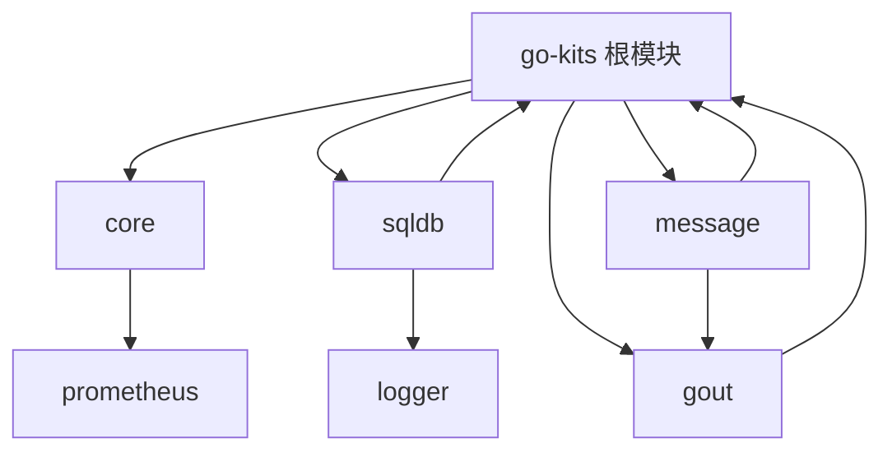

# Go-Kits 依赖管理指南

本文档介绍如何在 Go-Kits 项目中管理模块间的依赖关系，实现自动更新和版本同步。

## 项目结构

Go-Kits 采用 Go Workspace（工作区）架构，包含多个相互独立但可能存在依赖关系的模块：

```
go-kits/
├── go.work                 # 工作区配置文件
├── go.mod                  # 根模块
├── .go-version             # Go 版本配置
├── Makefile                # 项目管理命令
├── scripts/
│   └── update-deps.sh      # 依赖更新脚本
├── core/                   # 核心 Web 框架模块
├── logger/                 # 日志模块 (v1)
├── logger_v2/              # 日志模块 (v2, 基于 slog)
├── config/                 # 配置管理模块
├── redis/                  # Redis 客户端模块
├── sqldb/                  # 数据库模块
├── message/                # 消息处理模块
├── gout/                   # HTTP 客户端模块
├── prometheus/             # 监控模块
└── ...                     # 其他模块
```

## 依赖关系

### 内部依赖关系图



### 模块依赖详情

1. **core** 模块依赖：
   - `github.com/ffhuo/go-kits/prometheus`

2. **sqldb** 模块依赖：
   - `github.com/ffhuo/go-kits` (根模块)
   - `github.com/ffhuo/go-kits/logger`

3. **message** 模块依赖：
   - `github.com/ffhuo/go-kits/gout`
   - `github.com/ffhuo/go-kits` (根模块，间接)

4. **gout** 模块依赖：
   - `github.com/ffhuo/go-kits` (根模块)

## 依赖管理机制

### 1. Go Workspace 配置

`go.work` 文件定义了工作区中的所有模块：

```go
go 1.24.3

use .
use ./core
use ./logger
use ./config
use ./redis
use ./logger_v2
use ./excel
use ./message
use ./storage
use ./influxdb
use ./etcd
use ./prometheus
use ./mqtt
use ./gout
use ./sqldb
```

### 2. Replace 指令

对于有内部依赖的模块，在其 `go.mod` 文件中使用 `replace` 指令指向本地路径：

```go
// core/go.mod
module github.com/ffhuo/go-kits/core

go 1.24.3

replace github.com/ffhuo/go-kits/prometheus => ../prometheus

require (
    github.com/ffhuo/go-kits/prometheus v0.0.0-20250313031328-7f8485824d45
    // ... 其他依赖
)
```

### 3. 自动更新机制

通过 `go work sync` 命令，Go 工具链会：
- 自动解析工作区内的模块依赖
- 将内部依赖指向工作区内的本地模块
- 保持版本同步

## 使用方法

### 快速开始

```bash
# 查看可用命令
make help

# 完整更新所有依赖
make update

# 仅同步工作区
make sync

# 验证构建
make verify

# 查看依赖状态
make status
```

### 详细命令

#### 1. 依赖更新

```bash
# 方法 1: 使用 Makefile
make update

# 方法 2: 直接使用脚本
./scripts/update-deps.sh update

# 方法 3: 手动操作
go work sync
go mod tidy  # 在每个模块目录中执行
```

#### 2. 状态检查

```bash
# 查看所有模块的依赖状态
make status

# 查看特定模块的依赖
cd sqldb && go list -m all
```

#### 3. 版本更新

```bash
# 更新 Go 版本（修改 Makefile 中的 GO_VERSION）
make go-version-update

# 更新外部依赖到最新版本
make deps-update
```

#### 4. 开发工具

```bash
# 格式化代码
make fmt

# 代码检查
make lint

# 运行测试
make test

# 性能测试
make benchmark

# 覆盖率报告
make coverage
```

## 最佳实践

### 1. 添加新模块

当添加新模块时：

1. 在新模块目录中创建 `go.mod`：
   ```bash
   cd new-module
   go mod init github.com/ffhuo/go-kits/new-module
   ```

2. 更新 `go.work` 文件：
   ```go
   use ./new-module
   ```

3. 如果依赖其他内部模块，添加 `replace` 指令：
   ```go
   replace github.com/ffhuo/go-kits/other-module => ../other-module
   ```

4. 更新脚本和 Makefile 中的模块列表

### 2. 模块间依赖

- **推荐**：使用接口定义模块间的契约
- **避免**：循环依赖
- **建议**：保持依赖层次清晰

### 3. 版本管理

- 所有模块使用相同的 Go 版本
- 定期更新外部依赖
- 使用语义化版本号

### 4. 测试策略

```bash
# 测试单个模块
cd module-name && go test ./...

# 测试所有模块
make test

# 性能测试
make benchmark
```

## 故障排除

### 常见问题

1. **依赖解析失败**
   ```bash
   # 清理缓存重新构建
   make clean
   make update
   ```

2. **版本冲突**
   ```bash
   # 检查依赖状态
   make status
   
   # 手动同步
   go work sync
   ```

3. **模块找不到**
   ```bash
   # 确保 go.work 包含所有模块
   cat go.work
   
   # 重新添加模块
   go work use ./module-name
   ```

### 调试命令

```bash
# 查看工作区状态
go work edit -print

# 查看模块依赖树
go mod graph

# 查看特定模块的依赖
go list -m -json all
```

## 自动化脚本详解

### update-deps.sh 脚本功能

- `update`: 完整更新流程
- `sync`: 仅同步工作区
- `verify`: 验证构建
- `test`: 运行测试
- `status`: 显示依赖状态

### Makefile 目标

- 开发命令：`fmt`, `lint`, `test`
- 依赖管理：`update`, `sync`, `deps-update`
- 项目维护：`clean`, `coverage`, `benchmark`
- 工具安装：`install-tools`

## 扩展和定制

### 添加新的依赖管理功能

1. 编辑 `scripts/update-deps.sh`
2. 在 `Makefile` 中添加对应目标
3. 更新文档

### 自定义工作流

可以根据项目需要修改脚本，例如：
- 添加代码质量检查
- 集成 CI/CD 流程
- 自定义版本管理策略

## 总结

Go-Kits 的依赖管理系统通过以下机制实现自动化：

1. **Go Workspace**: 统一管理多个模块
2. **Replace 指令**: 将内部依赖指向本地路径
3. **自动化脚本**: 简化常用操作
4. **Makefile**: 提供便捷的命令接口

这个系统确保了：
- 模块间依赖的自动同步
- 版本的一致性
- 开发流程的标准化
- 构建和测试的可靠性 